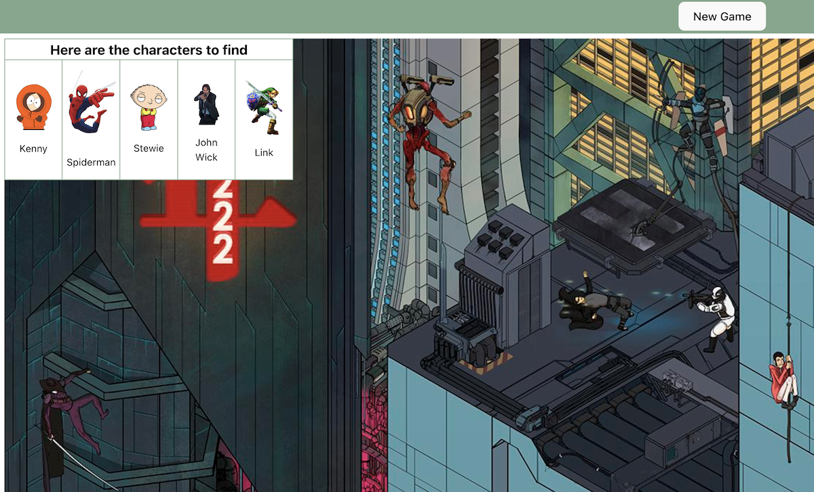

# Photo Finder App Backend

## Table of Contents

- [Description](#description)
- [Usage and Screenshots](#usage-and-screenshots)
- [Technologies Used](#technologies-used)
- [Dependencies and Credits](#dependencies-and-credits)
- [Project Structure](#project-structure)

## Description

RESTful API created as as a part of [The Odin Project](https://www.theodinproject.com/) curriculum.

## Usage and Screenshots



Here's a brief description of how to use the app.

- [Link to live preview](https://98256945.wheres-waldo-frontend-top.pages.dev/)
- [Link to frontend repo](https://github.com/aRav3n/wheres_waldo_frontend_TOP)

### Features

- Uses CORS to verify that the request is coming from a valid address

## Technologies Used

### Backend          
- <a href="https://nodejs.org"> Node.js</a>
- <a href="https://expressjs.com/"> Express</a>
- <a href="https://www.postgresql.org/"> PostgreSQL</a>
- <a href="https://www.prisma.io/"> Prisma ORM</a>
- <a href="https://www.typescriptlang.org/"> TypeScript</a>
- <a href="https://jestjs.io/"> Jest</a>

### Development Tools

- <a href="https://code.visualstudio.com/"> VS Code</a>
- <a href="https://www.npmjs.com/"> NPM</a>
- <a href="https://git-scm.com/"> Git</a>

### Hosting

- <a href="https://github.com/"> Github</a>
- <a href="https://neon.com/"> Neon</a>
- <a href="https://render.com/"> Render</a>

## Dependencies and Credits

### Package Dependencies

- [@prisma/extension-accelerate](https://www.npmjs.com/package/@prisma/extension-accelerate)
- [@prisma/client](https://www.npmjs.com/package/@prisma/client)
- [bcryptjs](https://www.npmjs.com/package/bcryptjs)
- [cors](https://www.npmjs.com/package/cors)
- [dotenv](https://www.npmjs.com/package/dotenv)
- [express-validator](https://www.npmjs.com/package/express-validator)
- [jsonwebtoken](https://www.npmjs.com/package/jsonwebtoken)
- [pg](https://www.npmjs.com/package/pg)
- [@types/node](https://www.npmjs.com/package/@types/node)
- [supertest](https://www.npmjs.com/package/supertest)
- [tsx](https://www.npmjs.com/package/tsx)

### Other Credits

- [Devicion](https://devicon.dev/)
- [Skillicons](https://skillicons.dev/)


## Project Structure

```bash

├──controllers/            # Controller files
├──db/                     # Compiled queries.js file
├──prisma/                 # Prisma models and migrations
├──public/                 # Locally hosted image files
├──routes/                 # Router files
├──src/                    # Base queries.ts file
└──test/                   # Test files

```
